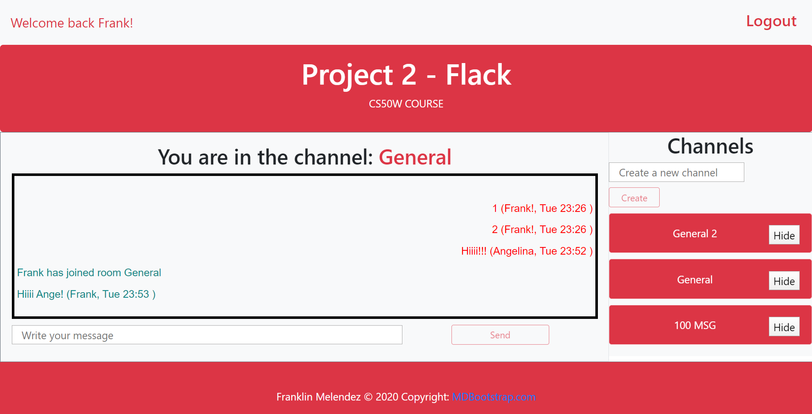

# Project 2

Web Programming with Python and JavaScript

Python and JavaScript talks thanks to Socket.IO.
Application.py contain server side code which listen and emits some data to client channel.js, user.js and message.js contain client side code changing and shaping look of website; style.css contains the lines of styling and index.html contain structure of website.

The requirements for the project 2 are outlined here: https://docs.cs50.net/web/2018/x/projects/2/project2.html

The display name and last selected channel are stored locally in the browser.

Personal touch: logout and hide button: if is clicked, hide the channel from the channel list.

# Screenshot

